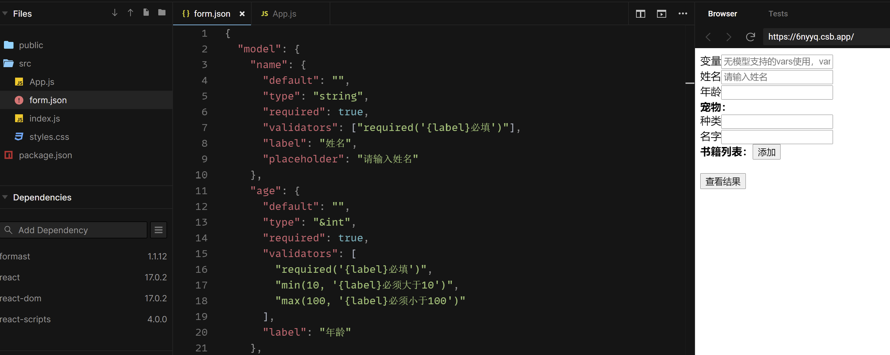

<h1 align="left"><a href="https://formast.js.org/">Formast</a></h1>

复杂业务场景下的企业级动态表单框架

## :hear_no_evil: 什么是 Formast?

Formast（帆桅）是一款应对复杂业务场景的动态表单框架，它基于（后端的）JSON 实现表单的界面渲染、交互、数据提交。

复杂业务系统中，存在很强的表单灵活性需求。业务方实际业务的快速变化，对表单的细节的变更很频繁。通过将表单的描述以 JSON 的形式动态交由前端渲染，可以在某些场景下，大大提升应对复杂业务的细节变更能力，而无需经过前后端代码修改和发版过程，让表单更加灵活，降低企业在表单处理中的开发成本。

Formast 从表单的原子逻辑出发，抽象出一门独特的描述语言，基于特定 Schema 的 JSON，解释为不同平台的表单交互界面，既可以跨框架，也可以跨终端。分层设计，区分模型与视图，从开发模式上彻底解决表单中数据与视图关系的混杂不清问题。独特的基于计算的依赖联动，让使用者以最简单的方式处理字段与字段之间的联动关系。在运行过程中，Formast 拥有不俗的性能。同时，相比于其他表单方案，Formast 更易于理解，更容易上手。

## :tada: 项目特色

- 专门为复杂业务场景的企业级表单设计，考虑到几十种业务表单的复杂需求，与大多数动态表单生成器都不同
- 表单抽象语言 Schema JSON 表达形式
- 分离表单 JSON 解释引擎和渲染引擎，轻松实现跨平台渲染
- 超高的性能
- 与现有框架无缝对接，支持 React、Vue，只提供核心驱动，其他全由开发者自由实现
- 分层理念：表单分为视图层、模型层、控制层（由 Formast 实现），在特定场景下这将大大提升表单的可靠性

## :book: 使用方法

你可以通过 npm 安装 formast：

```
npm i formast
```

也可以通过 CDN 直接引入 Foramst：

```html
<script src="https://unpkg.com/formast"></script>
```

它的导出方式有两种，不同的导出方式对构建工具或依赖的要求不同，你可以通过[快速上手](https://formast.js.org/#/quick-start)获得相关的使用信息。

大多数情况下，我们会使用 react 或 vue 的引擎来在项目中使用，通过读取后端接口返回的 JSON 来创建表单。具体效果如图：

[](https://codesandbox.io/s/dazzling-matan-d1c4j)

更多使用详情请 [阅读文档](https://formast.js.org)。

## :camel: 参与贡献

我们欢迎社区中所有同学参与贡献，无论是发现了某些代码层面的 bug，还是文档中的错别字，抑或功能上的缺陷，都可以向我们提 PR。如果你希望 Formast 在功能上进行扩展，或想到一些不错的想法，也可以在社区中向我们提出，一起探讨。

具体的贡献手册请[阅读这里](docs/contribution.md)。
## :balance_scale: 开源许可

MIT
